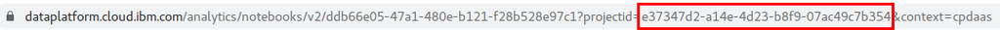

# Run a recommendation engine with Watson Studio and Elasticsearch on IBM Cloud

### **Motivation**

Recommendation engines are a big use case for corporate merchandising and site search 

There are good tutorials and code patterns for collaborative filtering recommendation engines running on Elasticsearch and Spark running locally 

For data science teams, the workflow can be hosted on a cloud platform  

IBM Cloud can run a ML model for recommendation using Watson Studio and Elasticsearch, but there are some hurdles.  In this tutorial we examine each and provide workarounds to successfully make the move to IBM Cloud


### **What's out there**

Some good tutorials that run locally, but not on cloud: 

- [Building a recommendation system with Spark ML and Elasticsearch](https://medium.com/@lijoabraham1234/building-a-recommendation-system-with-spark-ml-and-elasticsearch-abbd0fb59454)

- [Building Simple Recommender Systems for Elasticsearch](https://qbox.io/blog/building-simple-recommender-systems-for-elasticsearch-1)

- [Build a recommender with Apache Spark and Elasticsearch](https://developer.ibm.com/technologies/data-science/patterns/build-a-recommender-with-apache-spark-and-elasticsearch)

### **What we want**
We want to run one of these recommendation engine tutorials as a "Hello World" example for using Spark and Elasticsearch on Watson Studio on the IBM Cloud.  This will provide a Cloud hosted environment that a team of data scientists can use to develop and experiment with a collaborative filtering model for recommendations. 

Pick the IBM code pattern by [Richard Hagarty](https://developer.ibm.com/profiles/rich.hagarty) and [Nick Pentreath](https://developer.ibm.com/profiles/nickp)

https://developer.ibm.com/technologies/data-science/patterns/build-a-recommender-with-apache-spark-and-elasticsearch 

This is a very detailed end to end example of how to run a recommendation engine using Spark and Elasticsearch on a Jupyter notebook.  The data set is from Movie Lens and includes the process of locally setting up Elasticsearch, Spark, installing the [Elasticsearch Hadoop plugin](https://www.elastic.co/what-is/elasticsearch-hadoop), running the Jupyter notebook.

### **What we need**
- **An Elasticsearch instance that supports "Dense vector" field types.** This is used for efficiently applying the ALS algorithm on a data set, and is a feature provided in recent versions 7+ when using the non-free [X-Pack](https://www.elastic.co/downloads/x-pack) plugin 
    - IBM Cloud has two ways to run Elasticsearch, but both do not support dense vectors: 
        - [IBM Cloud Databases (ICD) Elasticsearch](https://cloud.ibm.com/catalog/services/databases-for-elasticsearch):  This is the hosted Elasticsearch service and the easiest way to run Elasticsearch on IBM Cloud, however the X-pack plugin that provides Dense Vector support is not available due to licensing limitations. 
        - [Bitnami Helm Chart](https://cloud.ibm.com/catalog/content/elasticsearch-Qml0bmFtaS1lbGFzdGljc2VhcmNo-global):  This is a Helm Chart provided by Bitnami that installs the open source Elasticsearch on your Kubernetes cluster.  By being the open version, it lacks the support for X-pack also. 

    - [Elastic.co Helm Chart for Elasticsearch](https://github.com/elastic/helm-charts/tree/master/elasticsearch):  This is an official Helm Chart that installs Elasticsearch into your Kubernetes cluster and has support for X-pack as a trial that can be extended via subscription.  The Helm Chart does not install on IBM Cloud due to [known user access limitations](https://github.com/elastic/helm-charts/issues/137) that are specific to IBM Cloud, so a [workaround](https://github.com/elastic/helm-charts/issues/137#issuecomment-503935443) is needed to install. 

- ### **A cloud hosted Jupyter Notebook environment with Spark.  This is needed to run the example code pattern**
    - [Watson Studio](https://cloud.ibm.com/catalog/services/watson-studio):  This IBM offering offers a Pyspark environment with Jupyter notebook that also happens to provide a kernel that supports both Spark 3 with Python 3.  It fills our requirements except that there is no built-in support for the Elasticsearch Hadoop plugin.  We'll go over a workaround that allows us to install arbitrary spark plugins on Watson Studio. 

# Steps to run the Code Pattern on Watson Studio
 
### **Pre-requisites**

- Working knowledge of IBM Cloud, Kubernetes, Helm Charts, Python and Jupyter Notebook  

- IBM Cloud account: Sign up for an account [here](https://cloud.ibm.com/registration)  

- Kubernetes cluster: Setup your cluster [here](https://cloud.ibm.com/kubernetes/catalog/create) 

- Helm 3 configurated on the Kubernetes cluster:  Follow the instructions [here](https://helm.sh/docs/intro/quickstart/)

### **Install the Elasticsearch Helm Chart on your Kubernetes Cluster**
Let's use Elasticsearch version 7.9.3,  Follow the [instructions to install the Helm Chart](https://github.com/elastic/helm-charts/tree/7.9.3/elasticsearch#install-released-version-using-helm-repository)

If you are running on IBM cloud, your Elasticsearch pods will fail to start with an error **"AccessDeniedException /usr/share/elasticsearch/data/nodes"** 

To get around this issue, create a file ibm-cloud-elasticsearch.yaml with these lines:
```
extraInitContainers: | 

  - name: create 

    image: busybox:1.28 

    command: ['mkdir', '/usr/share/elasticsearch/data/nodes/'] 

    volumeMounts:  

    - mountPath: /usr/share/elasticsearch/data  

      name: elasticsearch-master  

  - name: file-permissions 

    image: busybox:1.28 

    command: ['chown', '-R', '1000:1000', '/usr/share/elasticsearch/'] 

    volumeMounts:  

    - mountPath: /usr/share/elasticsearch/data  

      name: elasticsearch-master  

```
Deploy your helm chart with these overrides by typing:
- `helm install -f ibm-cloud-elasticsearch.yaml elasticsearch --version 7.9.3 elastic/elasticsearch` 

Set up a ingress to your Elasticsearch instance by following the instructions here under "Defining ingress rules" 

For IBM Cloud Kubernetes clusters, you can use the following configuration. 

Make sure to substitute the cluster name in {CLUSTER_NAME} and the region in {REGION}:

```
------------------- 

apiVersion: extensions/v1beta1 

kind: Ingress 

metadata: 

  name: elasticsearch 

  namespace: default 

  annotations: 

    ingress.bluemix.net/client-max-body-size: 'size=0' 

    ingress.bluemix.net/large-client-header-buffers: 'number=4 size=16k' 

    ingress.bluemix.net/redirect-to-https: 'true' 

    ingress.bluemix.net/hsts: 'enabled=true maxAge=31536000 includeSubdomains=true' 

spec: 

  tls: 

    - hosts: 

        - elasticsearch.{CLUSTER_NAME}.{REGION}.containers.appdomain.cloud 

      secretName: {CLUSTER_NAME} 

  rules: 

    - host: elasticsearch.{CLUSTER_NAME}.{REGION}.containers.appdomain.cloud 

      http: 

        paths: 

        - backend: 

            serviceName: elasticsearch-master 

            servicePort: 9200 
```

Name the file ingress.yaml, and run the following command: 

- `kubectl apply -f ingress.yaml` 

If we suppose that your cluster name is "mycluster" and the region is "us-south", the Elasticsearch instance will be reachable at the following hypothetical URL `https://elasticsearch.mycluster.us-south.containers.appdomain.cloud/`

In this scneario, if you hit this URL, you will see a message like this:


 

Congratulations you have setup a non-free instance of Elasticsearch 7.9.3 on you IBM cluster!

### **Setup Watson Studio**
[Create an instance of Watson Studio service](https://cloud.ibm.com/catalog/services/watson-studio) in your cluster 

Open Watson Studio, and click on the **"Get Started"** button


On the next screen, click on **"Create Project"**


On the next screen, click on **"Create an empty project"**


On the next screen, add a name "Recommendation Engine" and select the object storage ([Create one if you don't have one](https://cloud.ibm.com/objectstorage/create))


Click **"Create"**

The project is now created and ready to go.


Congratulations, you have set up a Watson Studio instance and created a project on IBM Cloud!

### **Load the recommendation engine notebook**
For this exercise we are using the following notebook from the IBM Code Pattern by [Richard Hagarty](https://developer.ibm.com/profiles/rich.hagarty) and [Nick Pentreath](https://developer.ibm.com/profiles/nickp) 

The Github repository can be found [here](https://github.com/IBM/elasticsearch-spark-recommender), and it has instructions on how to run the [notebook](https://github.com/IBM/elasticsearch-spark-recommender/blob/master/notebooks/elasticsearch-spark-recommender.ipynb) on a local environment. 

For Watson Studio we will use a [modified version]("./notebooks/Elasticsearch Collab Filtering with Spark Template.ipynb") of the notebook with specific code and instructions for running on IBM Cloud.

### **Load the notebook into Watson Studio** 
Click on the **"Add to Project"** button, and then select **"Notebook"** 


Download the notebook file locally, select the **"From file"** tab, and then drag and drop it into the section that says **"Drag and drop files here or upload"**.  Make sure to select the runtime to be **"Default Spark 2.4 & Python 3.7"**  Once this is done, click **"Create"** and the file will be uploaded as a notebook in the project. 


After a minute or so, the file will be uploaded, and the notebook will be open and available to edit in Watson Studio as a Jupyter Notebook. 

Now go and get the data support files from Movie Lens and the Elasticsearch Hadoop connector: 

In Watson Studio, click on the **"Find and add data"** icon, on the top icon bar near the right side of the page.  A "Data" section will open with a section that says **"Drag and drop files here or upload"**


Download and unzip the Movie Lens files: 

``` 
$ wget http://files.grouplens.org/datasets/movielens/ml-latest-small.zip 

$ unzip ml-latest-small.zip 
```
Drag and drop the following files: **movies.csv, ratings.csv, links.csv**

Now download the Elasticsearch Hadoop connector: 
``` 
$ wget https://artifacts.elastic.co/downloads/elasticsearch-hadoop/elasticsearch-hadoop-7.6.2.zip 

$ unzip elasticsearch-hadoop-7.6.2.zip 
``` 

Drag and drop the file **elasticsearch-spark-20_2.11-7.6.2.jar** under the dist directory. 

Congratulations, you have loaded the Notebook and the support files into Watson Studio!

## **Run the notebook in Watson Studio**

The notebook has been modified and annotated with comments starting with the string **"##### Watson Studio: "** that indicates specific modifications that are needed for the notebook to run on Watson Studio on IBM Cloud.  We will go over each one of these in order to get familiar with the different workarounds that are needed for the original code pattern to run on a cloud hosted system, and more specifically on Watson Studio. 

First thing to do is to load the files we just uploaded to the prior **"Find and add data"** step.  To do this, we need to modify the first cell of the notebook under the comment **"##### Watson Studio: Insert the Project ID and the Access Token"** 

In the line `project = Project(spark.sparkContext, {PROJECT_ID}, {ACCESS_TOKEN})` you will need to replace the PROJECT_ID and the ACCESS_TOKEN with the correct values, 

To find the PROJECT_ID, look in notebook URL, the PROJECT_ID value is in a project_id query parameter like this: 


To get the ACCESS_TOKEN, you need to create one.  Go to the project page and click on **"Settings"** tab.  Scroll down to the section named **"Access Tokens"**, click on **"New Token"**, and give it a token name, set it to **"Editor"** access, and click the **"Create"** button.  Once created, click on the triple dot menu to view and copy the access token.


Go back to the notebook and now you can use these two values in the cell and execute it (Shift + Enter) 


Now, the very next cell is a workaround to enable the Hadoop connector for Elasticsearch in our hosted Spark instance.  The Watson Studio GUI does not provide a way to add library JARs to the Spark lib path, and there is no built-in support for the Elasticsearch Hadoop connector.  This seems like a bit of a dead end, but there is a hint in the IBM Cloudpak for Data Spark Environment documentation about an NFS drive, which would come in very handy if that share were available to end users:  https://dataplatform.cloud.ibm.com/docs/content/wsj/analyze-data/spark-envs.html 

The relevant section is highlighted here: 


Our workaround is to run this cell once for the Spark environment.  So we will uncomment the code in the cell and run it once.  Then comment it again so it doesn't run anymore subsequently.  The cell has a comment that says **"##### Watson Studio: Insert the Hadoop connector JAR into the spark library path"**


Now that the file `elasticsearch-spark-20_2.11-7.6.2.jar` has been written to the directory `/home/spark/shared/user-libs/spark2/`, so now we need to comment the code in this cell, and restart the Kernel for the Elasticsearch Hadoop connector to function.  Click on the menu option **"Kernel -> Restart and clear output"**

The connector JAR is now fully functional and usable in the kernel. 

Next, the third cell has a comment **"##### Watson Studio: Insert the Elasticsearch connection credentials"**.  Here, there is a URL value that needs to be populated for {ELASTICSEARCH_URL}, this is the value of the URL for your Elasticsearch instance that was created earlier.  Run the Cell, and there will be some errors/warnings, that you can ignore. 


The 4th cell loads the files we uploaded into the project earlier.  It has the comment **"##### Watson Studio: Load the movie lens files from object storage"**


Keep running cells until you get to the 13th cell with the comment **"##### Watson Studio: Insert object storage credentials"**.  Follow the instructions on the comments and run it.


Before we move on, we need to take note of the Cloud Object Storage ID, this value will be used later on in similar code to load the **movies.csv** and the **links.csv** files from object storage.  Just take note of it and replace the values of {OBJECT_STORAGE_ID} with this value where it appears.  The value for this is found in the second argument to the load() function in the inserted code. 


Now, run the cells until you get to cell 16 with the comment **"##### Watson Studio: Load the movies.csv file"**

Follow the instructions in the comment to insert the correct value for the second argument for the load() function 


Now, run the cells until you get to cell 21 with the comment **"##### Watson Studio: Load the links.csv file"**

Follow the instructions in the comment to insert the correct value for the second argument for the load() function 

 
Cell 22 allows you to optionally add your TMDB key to load movie posters.  This is not necessary, but it does make the output look better! 

If you want to use an API and don't have one, you can sign up to get a free API KEY [here](https://developers.themoviedb.org/3/getting-started).


Congratulations, now you can run the rest of the notebook until the end and see recommendations based on the learned patterns the ALS Collaborative Filtering algorithm can infer from the data set! 

There are other notes about cloud workarounds under the **"##### Watson Studio:"** comment prefix.  These comments explain some changes to the original code that had to be made in order to run on Watson Studio, but the changes did not need manual intervention, so we don't cover those here.  Feel free to read the comments to see what other workarounds were added to the code pattern. 